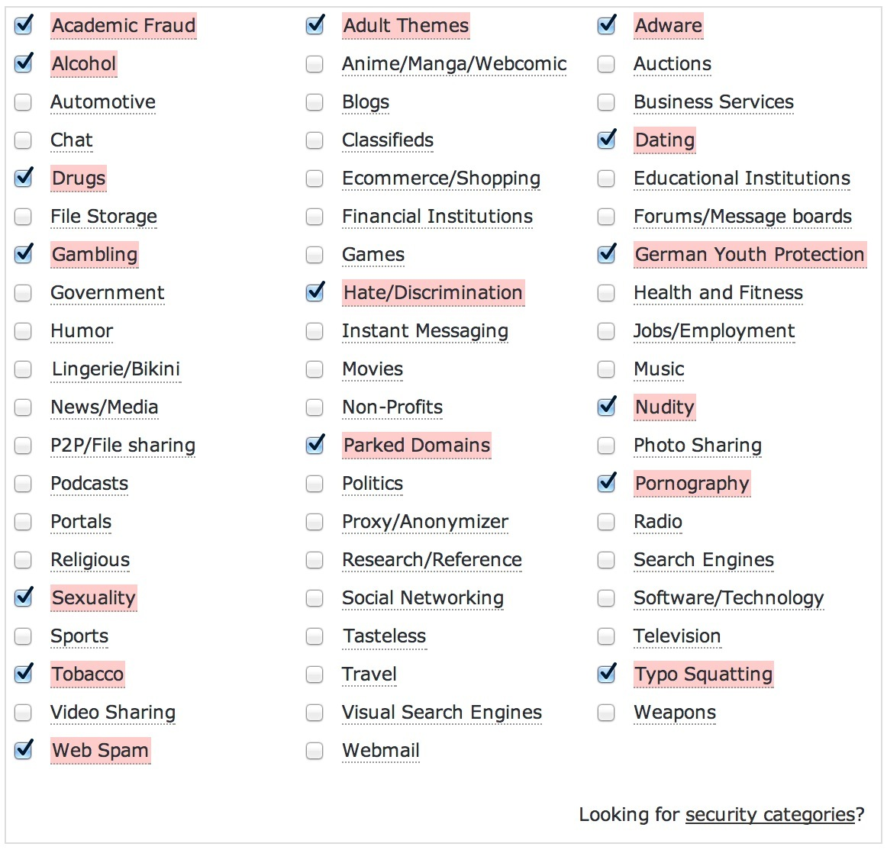

# Access limited to "lawful content"

In a [joint letter](http://www.portlandoregon.gov/revenue/article/497599) from the mayors of Portland, San Francisco, and New York to the FCC Chairman, the mayors are requesting government regulation to ensure "Net Neutrality." These mayors also introduced concerning language, identified by the hosts of the [No Agenda Podcast](http://www.noagendashow.com/), about their constituents being able to access "lawful" content.

> ...among them many students, parents, educators and others who are only able to connect to broadband at schools or libraries—are able to freely access lawful content without being confronted with delays that threaten adoption.

The US federal and state governments have already figured out how to regulate what is lawful content starting with the [CIPA Act of 2000](http://www.ncsl.org/research/telecommunications-and-information-technology/state-internet-filtering-laws.aspx). CIPA's power was attached to federal library grants. Those libraries that implemented child porn filters got free money and technology discounts or got left out. CIPA supposedly allows adults to request for library Internet filters to be disabled, but I'm quite sure I could not succeed in any such request at my library.

In my state, Georgia, a separate state law requires public schools and public libraries to adopt and enforce reasonable policies of "Internet safety" that will protect children from access to "harmful" material. The law prohibits a public school or library from receiving state funds unless it implements and enforces an acceptable-use policy.

Since CIPA intends to "protect children" from "harmful" websites, not only did librarians want to get more funding, but they got caught in the glamor of protecting innocent children. In the meanwhile, the FCC has been [creating guidelines](https://www.fcc.gov/guides/childrens-internet-protection-act) to help condition students to what acceptable content is. Where children spend most of their days, school and the library, are subject to mandatory filtering and monitoring. As our kids grow, they'll already have the expectation that they're being watched and filtered by government entities.

My own county library's [Internet acceptable use and safety policy](http://forsythpl.org/aboutFCPL/showPolicy.aspx#policy_anchor_18) has a warning about the futility of CIPA mandated Internet filters, warning parents to monitor computer use "closely."

> In accordance with the Children's Internet Protection Act (CIPA), all library computers are equipped with software that is designed to block access to sites that contain visual depictions and/or information which may reasonably be construed as being obscene, child pornography, or materials "harmful to minors" as currently defined by law. Despite these provisions, patrons may still encounter sites they find personally offensive. For this reason, patrons must assume responsibility for their own use of the Internet. Parents who are concerned about the contents of the Internet are strongly advised to closely supervise their children's use of this service and assist them in selecting sites that are consistent with personal and family values and appropriate for the age and understanding of their children.

Strangely, with all I know about the Internet and technology, have basically no fear that my kids will find inappropriate content on the Internet until they're much older. Before you label me in as a bad parent, I "protect" my kids Internet at home with filtered DNS requests through [OpenDNS](http://www.opendns.com/).

The defining difference with my use of OpenDNS is that I chose a provider of filtering, judged my own level of trust in their service and accuracy, select what I do and do not want filtered, and can turn it off when I feel like it. I didn't implement my household filter as part of a government mandate.

It's the "lawful content" part I keep coming back to, though. When I visited my county library earlier this year, I opened [Calibre](http://calibre-ebook.com/), an e-book manager, and was notified of an available update. Upon attempting to load the Calibre site, I was notified that I was attempting to view inappropriate content. I had to petition to the IT staff to get a whitelist exception added to the library proxy. It was a perfect example of how to protect against "harmful" content, the filters have to err on the side of more aggressive content restrictions.

Government intrusions don't ever get smaller. Federal and state agencies have already decided what is lawful content on the Internet and have coerced or mandated the filtering of it. Where will the next bit intrusion creep up? *Who will be deciding what is lawful?* In [a blog article](https://deekayen.net/exploiting-noninterventionalists), I experimented with loading alternate operating systems on library computers and bypassing Internet filters. Most people don't have such a skillset, or even a knowledge about what options are available to them under CIPA (like requesting to disable the library filters), so their filtered access to the Internet will continue - it will be the norm. That's not really OK.

## Not trusting anonymity networks

Millions of people use anonymity services. TorrentFreak [keeps a list of the VPN providers](http://torrentfreak.com/which-vpn-services-take-your-anonymity-seriously-2014-edition-140315/) that they think take anonymity seriously.

In 2011, at the height of fame for [Lulzsec](https://en.wikipedia.org/wiki/LulzSec), I was a user of the VPN provider [HideMyAss!](https://www.hidemyass.com/). Then it [became public that HideMyAss! started keeping logs](http://www.theregister.co.uk/2011/09/26/hidemyass_lulzsec_controversy/) in order to comply with a court order to identify a member of Lulzsec. Certainly, one way to handle the court order was to comply as they did.

I stopped using HideMyAss! and switched to [AceVPN](http://www.acevpn.com/) after actually reading their privacy policy in great detail. Only later did I discover, through a momentary mis-configuration of one of their VPN servers, that they use a [Squid caching proxy](http://www.squid-cache.org/) to optimize web delivery. While using Squid isn't "logging" traffic, it's certainly at least keeping breadcrumbs of what sites were browsed through that VPN server. It's the VPN server equivalent of keeping track of all the library books you've checked out.

I stopped using AceVPN shortly after that and started using one of TorrentFreak's recommendations, [proxy.sh](https://proxy.sh/panel/aff.php?aff=115). They claim they don't log anything, that payments are disassociated from VPN login credentials, and have a [warrant canary](https://en.wikipedia.org/wiki/Warrant_canary) message. Their headquarters is also in the obscure [Republic of Seychelles](https://en.wikipedia.org/wiki/Seychelles).

In spite of all the efforts a company like proxy.sh, they're still a public service. That means government agencies can sign up for the service just like any other average person and discover all the VPN service locations, service ports, and protocols. That gives agencies like the NSA all they need to know to target datacenters and backbone providers through beam splitter rooms like [Room 641A](https://en.wikipedia.org/wiki/Room_641A).

The NSA doesn't need to get court orders for a company like proxy.sh, because their mandate is to track the communications of non-US people. A provider like proxy.sh leases virtual private server space from providers all over the world and the governments in those locations could just as easily issue a [National Security Letter](https://en.wikipedia.org/wiki/National_security_letter) to a regional datacenter without even involving proxy.sh and triggering their warrant canary, or even more extreme, causing a [hara-kari](https://www.wordnik.com/words/hara-kiri) like [Lavabit](http://www.theguardian.com/technology/2013/aug/08/lavabit-email-shut-down-edward-snowden).

The problem is that the NSA's mandate forces them to treat users of any anonymity VPN provider (or [Tor](https://www.torproject.org/)) as a suspicious person. Therefore, by using an anonymity VPN company, you may bypass logging by your ISP or tracking by Google, but you're assuredly using an Internet endpoint that is being monitored by spy agencies. Moreover, that those spy agencies are paying extra attention to your VPN endpoint just because you felt the need to use a VPN.

Even if you layer Tor through an anonymous VPN provider, the use of [sslstrip](http://www.thoughtcrime.org/software/sslstrip/) on exit nodes is a known vulnerability. The authority operators even keep a list of [badExit nodes](https://trac.torproject.org/projects/tor/wiki/doc/badRelays) that are known to do SSL man-in-the-middle attacks or strip SSL. Just one, non-government guy in the world needs to think it would be funny to setup a Tor exit node, log all your stripped SSL, and post it to the Internet for your VPN-wrapped Tor connection to be rendered pointless. Things like this have happened more than once, and even [lasted for months](http://invisibler.com/tor-compromised/).

## What's a private person to do?

I think you have to assume that any organized, anonymous VPN provider has all of their VPN servers get extra-special attention from spy agencies. That includes any provider listed by TorrentFreak, Tor, [I2P](https://geti2p.net), [YaCy](http://yacy.net/), anonymous web proxies, etc.

When making a plan for your anonymity, confidentiality, privacy, or even circumvention of filters, you have to consider your priorities and what your ultimate goals are. Using a service, like proxy.sh, may bypass Internet filtering, but exchanges the access for additional endpoint monitoring by government agencies.

In this guide, I propose a configuration to use your own VPN server which may not necessarily be targeted for extra scrutiny by spy agencies, can bypass Internet censorship like the [Great Firewall of China](https://en.wikipedia.org/wiki/Great_Firewall_of_China), and doesn't use un-trusted or even hostile endpoints like with Tor. It can bypass most deep packet inspection technologies unless your available Internet connection ports are restricted to ones which your private VPN server doesn't have setup.

This guide uses ports 80 (HTTP) and 443 (HTTPS), the most likely ports to be available on even the most restricting Internet connections. By using your own, private VPN server and obfuscating your VPN server's traffic with tools from Tor, I think you get the best mix of breaking through censorship, privacy, and logging by your ISP.

This guide will discuss the use of [obfs3 (The Threebfuscator)](https://gitweb.torproject.org/pluggable-transports/obfsproxy.git/blob/HEAD:/doc/obfs3/obfs3-protocol-spec.txt) and [ScrambleSuit](https://kryptera.se/wp-content/uploads/2014/02/ScrambleSuit-A-Polymorphic-Network-Protocol-to-Circumvent-Censorship.pdf). They protocol obfuscation layers for TCP protocols. When combined with OpenVPN hosting VPN service on TCP ports 80 and 443, not only will your Internet traffic be un-readable, but deep packet inspection won't even be able to tell what you're doing on the Internet. The best your ISP will be able to assume is that your connections over port 80 or 443 are encrypted websites. If they attempt to connect to your OpenVPN server with a web browser, it won't respond because it's not a web server!
